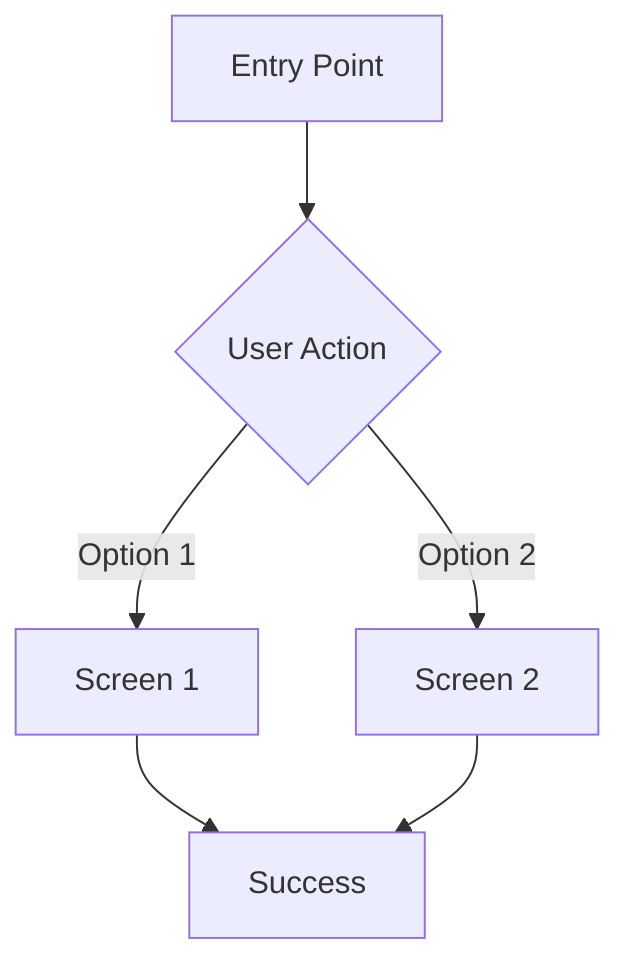

# [Feature Name] - User Flows

## Primary Flow: [Flow Name]

**Entry Points:**
- [Where users arrive from]
- [Alternative entry point]

**Flow:**

**Steps:**
1. User arrives at [entry point]
2. User sees [what]
3. User can [action]
4. System responds with [result]
5. User proceeds to [destination]

**Exit Points:**
- Success: [Where user goes]
- Cancel: [Where user goes]
- Error: [Where user goes]

---

## Alternative Flow: [Flow Name]

[Same structure]

---

## Error Flow: [Scenario]

**Trigger:** [What causes this error]

**Flow:**
1. [Step]
2. [Step]
3. [Recovery option]

**Recovery:** [How user gets back on track]
